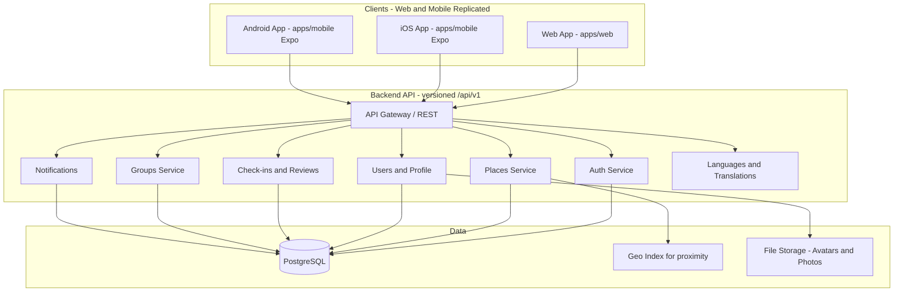

# Pilgrimage Tracker – System Architecture

This document describes the end-to-end architecture for Pilgrimage Tracker: a multi-platform application (desktop web, mobile web, iOS, Android) for discovering, visiting, and tracking religious places. It aligns with the designs in [app-design-prompt-google-stitch.md](app-design-prompt-google-stitch.md) and [DESIGN_FILE.html](DESIGN_FILE.html).

---

## 1. Goals and Constraints

- **Platforms:** Desktop web, mobile web, iOS app, Android app.
- **Frontend:** Single, shared UI codebase where possible so behavior and layout are consistent across all platforms.
- **Design reference:** DESIGN_FILE.html (Tailwind, Lexend, Material Icons, safe areas, list/map views, religion-specific place details, groups, profile, check-ins).

---

## 2. High-Level Architecture



- **Clients:** Two frontend codebases kept in sync by convention and tooling:
  - **Web:** `apps/web` — React SPA (desktop + mobile web).
  - **Mobile:** `apps/mobile` — **Expo (React Native)** app for iOS/Android. Same API and feature set as web; UI implemented with React Native and Expo. A Cursor rules file enforces feature parity between web and mobile; no shared `packages` folder (see repo layout below).
- **Backend:** Single **versioned** API (e.g. `/api/v1/...`) talking to PostgreSQL, optional geo index, and file storage.

---

## 3. Recommended Tech Stack

### 3.1 Frontend (shared codebase)

| Concern | Choice | Rationale |
|--------|--------|-----------|
| Framework | React 18+ | Matches design system (components, state), large ecosystem. Web: Vite + React; mobile: Expo (React Native). |
| Build | Vite | Fast dev and build for web. |
| Styling | Tailwind CSS | Matches DESIGN_FILE.html (Tailwind, design tokens). |
| Routing | React Router (web) / Expo Router or React Navigation (mobile) | SPA routing for web; stack/tab navigation for Expo. |
| State | React Query + Context or Zustand | Server state (places, user, groups) + minimal client state. |
| Forms/validation | React Hook Form + Zod | Registration, login, reviews, group creation. |
| Maps | Mapbox GL JS or Leaflet (web); react-native-maps or Expo map (mobile) | List + map view. |
| Icons/fonts | Material Icons + Lexend (web); Expo vector icons or similar (mobile) | Per DESIGN_FILE. |
| Native shell | Expo (React Native) | iOS/Android via Expo; access to camera, geolocation, push. |

**Responsive strategy:** One layout with breakpoints (e.g. sm/md/lg) so the same components work on desktop and mobile web; bottom nav on mobile, optional sidebar/top nav on desktop.

### 3.2 Backend

| Concern | Choice | Rationale |
|--------|--------|-----------|
| Runtime | Python 3.14 (or 3.11+) | Type hints, async support. Use latest available (e.g. Homebrew on macOS). |
| Framework | FastAPI | REST API, OpenAPI docs, Pydantic validation. |
| Server | Uvicorn (ASGI) | Runs FastAPI. |
| Database | PostgreSQL (or SQLite for local dev) | Relational data (users, places, check-ins, groups, reviews). |
| Geo | PostGIS or lat/lng + distance in DB | Proximity sort “nearest first”. |
| Auth | JWT; python-jose or PyJWT; passlib; optional OAuth | Matches “Continue with Google/Apple” in designs. |
| File storage | S3-compatible (boto3) or local uploads | Avatars, place photos, review photos. |
| Email | SendGrid or similar | Password reset, optional group invites. |

### 3.3 Monorepo Layout (recommended)

```
pilgrimage-tracker/
├── apps/
│   ├── web/                 # Vite React app (desktop + mobile web). Own api client, types, constants.
│   └── mobile/              # Expo (React Native) app. Same API and features as web (no shared packages).
├── server/                  # Backend API (Python + FastAPI), versioned at /api/v1
│   ├── app/
│   │   ├── main.py          # FastAPI app, CORS, router includes
│   │   ├── api/v1/          # Routers: auth, users, places, reviews, groups, notifications, i18n
│   │   ├── core/             # Config, security (JWT), dependencies
│   │   ├── models/          # Pydantic schemas (request/response)
│   │   └── db/              # Store or SQLAlchemy models; i18n (languages, translations); seed_data.json + seed.py
│   ├── requirements.txt
│   └── pyproject.toml       # Optional
├── .cursor/
│   └── rules/               # Cursor rules: e.g. replicate frontend UI/features in both web and mobile
├── DESIGN_FILE.html
├── app-design-prompt-google-stitch.md
├── ARCHITECTURE.md
└── IMPLEMENTATION_PROMPTS.md
```

**Why no shared `packages`:** Shared packages can be hard to maintain in production (e.g. build/deploy and import paths differ for web vs mobile). Instead, **replicate** frontend code in both `apps/web` and `apps/mobile`. Use a **Cursor rules file** (e.g. in `.cursor/rules/`) that states: *when adding or changing UI or features in one app (web or mobile), replicate the same UI and behavior in the other app so both stay in sync.* Business logic, screens, and design should be identical; only app-specific config (e.g. Expo config, env vars) may differ.

**Expo:** `apps/mobile` is an Expo (React Native) app built for iOS/Android. Both web and mobile call the same versioned API. Backend is Python + FastAPI; same API contract so frontends need no backend code changes.

**Migration:** If the project was started with a Node.js/Express backend (e.g. after Prompts 1–3), see the "Migration: Node.js backend → Python/FastAPI" section in [IMPLEMENTATION_PROMPTS.md](IMPLEMENTATION_PROMPTS.md) for how to replace the backend with Python + FastAPI without changing the frontend.

---

## 4. Data Model (core entities) — code-based references

All entities are identified by a **stable, autogenerated code** (e.g. `user_code`, `place_code`), not by numeric/serial IDs. Codes are unique per table and used in APIs and foreign keys. They may include a **prefix or suffix** (e.g. `usr_abc12`, `plc_xyz99`) to make them easy to distinguish in logs and URLs; this prefix/suffix is **not** used in business logic — treat the code as an opaque string everywhere in application code.

- **User:** user_code (PK, autogenerated), email, password_hash, display_name, avatar_url, created_at, updated_at. **Preferred religions** (filter) are stored in user settings (`religions`: list of islam, hinduism, christianity); empty list means “show all”.
- **Place:** place_code (PK, autogenerated), name, religion, place_type (e.g. mosque, temple, church), lat, lng, address, opening_hours (JSON or table), image_urls[], description. Religion-specific fields (JSON or columns): e.g. deities[], festival_dates, denomination, prayer_times.
- **CheckIn:** check_in_code (PK, autogenerated), user_code (FK), place_code (FK), checked_in_at, note, photo_url (optional).
- **Review:** review_code (PK, autogenerated), user_code (FK), place_code (FK), rating (1–5), title, body, photo_urls[], created_at.
- **Favorite:** user_code (FK), place_code (FK) — composite PK.
- **Group:** group_code (PK, autogenerated), name, description, created_by_user_code (FK), invite_code (for joining), is_private, created_at.
- **GroupMember:** group_code (FK), user_code (FK), role (admin/member), joined_at — composite PK.
- **GroupInvite:** invite_code or id (as needed), group_code (FK), email or link, expires_at, used_at.
- **Notification:** notification_code (PK, autogenerated), user_code (FK), type (e.g. group_invite, check_in_activity), payload (JSON), read_at, created_at.

**Proximity:** Places sorted by distance using user’s lat/lng (from browser/device) and stored place coordinates (PostGIS or `ORDER BY distance` formula).

---

## 5. API Outline (REST) — versioned and code-based

All API routes are **versioned** under `/api/v1` (e.g. `/api/v1/places`). Paths and bodies use **entity codes** (e.g. `place_code`, `user_code`), not numeric IDs.

- **Auth:** `POST /api/v1/auth/register`, `POST /api/v1/auth/login`, `POST /api/v1/auth/forgot-password`, `POST /api/v1/auth/reset-password`, `POST /api/v1/auth/refresh`, optional `GET/POST /api/v1/auth/oauth/google|apple`.
- **Users:** `GET/PATCH /api/v1/users/me`, `GET /api/v1/users/me/check-ins`, `GET /api/v1/users/me/favorites`, `GET /api/v1/users/me/stats` (responses use `user_code`, `place_code`, etc.).
- **Settings:** `GET/PATCH /api/v1/users/me/settings` (theme, language, units, **religions**). Preferred religions (list) are used as a filter; empty = show all places.
- **Places:** `GET /api/v1/places?religion=&religion=&...` (repeat `religion` for multiple; omit for all), plus lat, lng, radius, type, sort. Each item includes `place_code`. `GET /api/v1/places/:placeCode`.
- **Check-ins:** `POST /api/v1/places/:placeCode/check-in`, `GET /api/v1/users/me/check-ins` (each item references `place_code`, `user_code`).
- **Reviews:** `GET /api/v1/places/:placeCode/reviews`, `POST /api/v1/places/:placeCode/reviews`, `PATCH/DELETE /api/v1/reviews/:reviewCode`.
- **Favorites:** `POST/DELETE /api/v1/places/:placeCode/favorite`, `GET /api/v1/users/me/favorites`.
- **Groups:** `GET /api/v1/groups`, `POST /api/v1/groups`, `GET /api/v1/groups/:groupCode`, `PATCH /api/v1/groups/:groupCode`, `POST /api/v1/groups/:groupCode/join`, `POST /api/v1/groups/:groupCode/invite`, `GET /api/v1/groups/:groupCode/members`, `GET /api/v1/groups/:groupCode/leaderboard`, `GET /api/v1/groups/:groupCode/activity`. Request/response bodies use `group_code`, `user_code`.
- **Notifications:** `GET /api/v1/notifications`, `PATCH /api/v1/notifications/:notificationCode/read`.
- **i18n (no auth):** `GET /api/v1/languages` (list of supported languages: code, name), `GET /api/v1/translations?lang=en|ar|hi` (key→value map; fallback to English for missing keys). User preference for language is stored in `GET/PATCH /api/v1/users/me/settings` (`language` field). Frontends use these endpoints for all customer-facing strings and set RTL when locale is Arabic.

All authenticated routes use JWT in `Authorization: Bearer <token>`.

---

## 6. Frontend Structure (web and mobile replicated)

### 6.1 Web app (apps/web) layout

The web app uses a TypeScript architecture with clear separation of concerns under `apps/web/src/`:

- **`app/`** – Application shell: `App.tsx`, `providers.tsx` (Auth, I18n), `routes.tsx`, and all page components under `app/pages/` (Splash, Login, Register, Home, PlaceDetail, Profile, Favorites, Groups, Notifications, Settings, etc.). Entry is `main.tsx` → `App` → providers → routes.
- **`components/`** – Shared UI: `Layout`, `ProtectedRoute`, `PlaceCard`, `PlacesMap`, `EmptyState`, `ErrorState`. Used by pages and layout.
- **`lib/`** – Shared logic and data: `lib/api/client.ts` (all API calls), `lib/types/index.ts` (Place, User, Group, etc.), `lib/theme.ts`, `lib/constants.ts`, `lib/share.ts`. Types and API client use code-based identifiers (`place_code`, `user_code`, etc.) per ARCHITECTURE §4–5.
- **State:** Auth and i18n live in `app/providers.tsx` (React context). No separate `stores/` folder; server state (places, groups, etc.) is fetched via `lib/api/client.ts` and held in page/local state or could be extended with React Query.
- **Assets:** Static assets (e.g. images, favicon) live in `public/`; fonts and icons are loaded via `index.html` (Lexend, Material Symbols).

### 6.2 Mobile app (apps/mobile)

- Same routes and flows as web; own `api/` and types; Expo/React Native screens and navigation.

### 6.3 Cross-cutting

- **Routes:** Splash → Login/Register → Preferred religions (multi-select, optional) → Home. Home (list/map), Place detail (by `placeCode`), Profile, Groups list, Group detail (by `groupCode`), Favorites, Settings, Notifications, Write review. Use the same route names and **codes** in both `apps/web` and `apps/mobile` (e.g. `/places/:placeCode`).
- **Layout:** Responsive shell with bottom nav on small screens and optional top/side nav on large screens; safe-area padding for notched devices (as in DESIGN_FILE). Implement in both web and mobile.
- **State:** Current user (with **preferred religions** from settings, used as filter) in context/store; places, place detail, groups, and notifications via API client (and optionally React Query) in each app. Each app has its own API client and types; no shared packages.
- **i18n:** Both web and mobile fetch languages and translations from the backend (`/api/v1/languages`, `/api/v1/translations?lang=`). Locale from user settings when logged in, else localStorage/AsyncStorage or browser. All customer-facing copy uses translation keys and `t(key)`. When locale is Arabic, set RTL (web: `document.documentElement.dir`; mobile: `I18nManager.forceRTL`).
- **Design tokens:** Centralize Tailwind theme (primary, background-light, fonts, radii) to match DESIGN_FILE.html in **both** apps.
- **Cursor rule:** A rule in `.cursor/rules/` must require that when adding or changing UI or features in `apps/web`, the same changes are replicated in `apps/mobile`, and vice versa, so the two codebases stay in sync.

---

## 7. Security and Deployment (summary)

- **HTTPS only;** secure cookies or httpOnly refresh token if using cookie-based refresh.
- **Rate limiting and validation** on auth and write endpoints.
- **CORS** configured for web origin(s); Expo app uses same API origin.
- **Deployment:** Backend on a VPS or PaaS (e.g. Railway, Render); DB managed (e.g. Supabase, Neon). Web app on Vercel/Netlify or same host as API. iOS/Android built via Expo (EAS or local) and submitted to App Store / Play Store.

---

## 8. Design Alignment

- **Screens to implement** (from DESIGN_FILE.html and app-design-prompt): Splash, Create Account, Login, Forgot Password, Preferred religions (multi-select, optional), Home (list + map), Place detail (Islam/Hinduism/Christianity variants), Check-in flow, Profile and stats, Groups list, Group detail and leaderboard, Favorites, Settings, Notifications, Write review. Empty and error states as specified in the design prompt.
- **Design system:** Lexend, Material Icons/Symbols, Tailwind with tokens from DESIGN_FILE (primary, borders, radii, safe areas). Support light/dark where designs specify (e.g. Place detail Hindu temple).

This architecture keeps one frontend codebase for desktop, mobile web, and native iOS/Android while supporting a scalable backend and clear separation of concerns. Implementation is split into phased prompts in [IMPLEMENTATION_PROMPTS.md](IMPLEMENTATION_PROMPTS.md).
