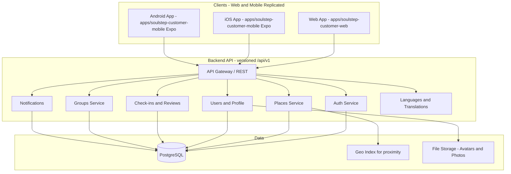

# SoulStep – System Architecture

This document describes the end-to-end architecture for SoulStep: a multi-platform application (desktop web, mobile web, iOS, Android) for discovering, visiting, and tracking religious places. It aligns with the designs in [app-design-prompt-google-stitch.md](app-design-prompt-google-stitch.md) and [DESIGN_FILE.html](DESIGN_FILE.html).

---

## 1. Goals and Constraints

- **Platforms:** Desktop web, mobile web, iOS app, Android app.
- **Frontend:** Single, shared UI codebase where possible so behavior and layout are consistent across all platforms.
- **Design reference:** DESIGN_FILE.html (Tailwind, Lexend, Material Icons, safe areas, list/map views, religion-specific place details, groups, profile, check-ins).

---

## 2. High-Level Architecture



- **Clients:** Two frontend codebases kept in sync by convention and tooling:
  - **Web:** `apps/soulstep-customer-web` — React SPA (desktop + mobile web).
  - **Mobile:** `apps/soulstep-customer-mobile` — **Expo (React Native)** app for iOS/Android. Same API and feature set as web; UI implemented with React Native and Expo. A Cursor rules file enforces feature parity between web and mobile; no shared `packages` folder (see repo layout below).
- **Backend:** Single **versioned** API (e.g. `/api/v1/...`) talking to PostgreSQL, optional geo index, and file storage.

---

## 3. Recommended Tech Stack

### 3.1 Frontend (shared codebase)

| Concern | Choice | Rationale |
|--------|--------|-----------|
| Framework | React 18+ | Matches design system (components, state), large ecosystem. Web: Vite + React; mobile: Expo (React Native). |
| Build | Vite | Fast dev and build for web. |
| Styling | Tailwind CSS | Matches DESIGN_FILE.html (Tailwind, design tokens). |
| Routing | React Router (web) / Expo Router or React Navigation (mobile) | SPA routing for web; stack/tab navigation for Expo. |
| State | React Query + Context or Zustand | Server state (places, user, groups) + minimal client state. |
| Forms/validation | React Hook Form + Zod | Registration, login, reviews, group creation. |
| Maps | Mapbox GL JS or Leaflet (web); react-native-maps or Expo map (mobile) | List + map view. |
| Icons/fonts | Material Icons + Lexend (web); Expo vector icons or similar (mobile) | Per DESIGN_FILE. |
| Native shell | Expo (React Native) | iOS/Android via Expo; access to camera, geolocation, push. |

**Responsive strategy:** One layout with breakpoints (e.g. sm/md/lg) so the same components work on desktop and mobile web; bottom nav on mobile, optional sidebar/top nav on desktop.

### 3.2 Backend

| Concern | Choice | Rationale |
|--------|--------|-----------|
| Runtime | Python 3.14 (or 3.11+) | Type hints, async support. Use latest available (e.g. Homebrew on macOS). |
| Framework | FastAPI | REST API, OpenAPI docs, Pydantic validation. |
| ORM | SQLModel | Modern ORM for FastAPI (builds on SQLAlchemy and Pydantic). |
| Server | Uvicorn (ASGI) | Runs FastAPI. |
| Database | SQLite (Dev) / PostgreSQL (Prod) | Relational data (users, places, check-ins, groups, reviews). |
| Geo | Lat/lng + distance in DB | Proximity sort “nearest first” (haversine formula). |
| Auth | JWT; python-jose or PyJWT; passlib; optional OAuth | Matches “Continue with Google/Apple” in designs. |
| File storage | S3-compatible (boto3) or local uploads | Avatars, place photos, review photos. |
| Email | SendGrid or similar | Password reset, optional group invites. |

### 3.3 Monorepo Layout (recommended)

```
soulstep/
├── apps/
│   ├── soulstep-customer-web/                 # Vite React app (desktop + mobile web). Own api client, types, constants.
│   ├── soulstep-customer-mobile/              # Expo (React Native) app. Same API and features as web (no shared packages).
├── soulstep-catalog-api/                  # Backend API (Python + FastAPI), versioned at /api/v1
│   ├── app/
│   │   ├── main.py          # FastAPI app, CORS, router includes
│   │   ├── api/v1/          # Routers: auth, users, places, reviews, groups, notifications, i18n
│   │   ├── core/             # Config, security (JWT), dependencies
│   │   ├── models/          # Pydantic schemas (request/response)
│   │   └── db/              # Store or SQLAlchemy models; i18n (languages, translations); seed_data.json + seed.py
│   ├── requirements.txt
│   └── pyproject.toml       # Optional
├── .cursor/
│   └── rules/               # Cursor rules: e.g. replicate frontend UI/features in both web and mobile
├── DESIGN_FILE.html
├── app-design-prompt-google-stitch.md
├── ARCHITECTURE.md
└── IMPLEMENTATION_PROMPTS.md
```

**Why no shared `packages`:** Shared packages can be hard to maintain in production (e.g. build/deploy and import paths differ for web vs mobile). Instead, **replicate** frontend code in both `apps/soulstep-customer-web` and `apps/soulstep-customer-mobile`. Use a **Cursor rules file** (e.g. in `.cursor/rules/`) that states: *when adding or changing UI or features in one app (web or mobile), replicate the same UI and behavior in the other app so both stay in sync.* Business logic, screens, and design should be identical; only app-specific config (e.g. Expo config, env vars) may differ.

**Expo:** `apps/soulstep-customer-mobile` is an Expo (React Native) app built for iOS/Android. Both web and mobile call the same versioned API. Backend is Python + FastAPI; same API contract so frontends need no backend code changes.

**Migration:** If the project was started with a Node.js/Express backend (e.g. after Prompts 1–3), see the "Migration: Node.js backend → Python/FastAPI" section in [IMPLEMENTATION_PROMPTS.md](IMPLEMENTATION_PROMPTS.md) for how to replace the backend with Python + FastAPI without changing the frontend.

---

## 4. Data Model (core entities) — code-based references

All entities are identified by a **stable, autogenerated code** (e.g. `user_code`, `place_code`), not by numeric/serial IDs. Codes are unique per table and used in APIs and foreign keys. They may include a **prefix or suffix** (e.g. `usr_abc12`, `plc_xyz99`) to make them easy to distinguish in logs and URLs; this prefix/suffix is **not** used in business logic — treat the code as an opaque string everywhere in application code.

- **User:** user_code (PK, unique string), email, password_hash, display_name, avatar_url, created_at, updated_at.
- **UserSettings:** user_code (FK), notifications_on, theme, units, language, religions (list).
- **Visitor:** visitor_code (PK, `vis_` + 16 hex chars), created_at, last_seen_at — anonymous identity for unauthenticated users. Created on first app load; code stored in localStorage/AsyncStorage.
- **VisitorSettings:** visitor_code (FK), theme, units, language, religions (JSON) — same fields as UserSettings. Merged into UserSettings on login/register (where user settings are still at defaults), then deleted.
- **Place:** place_code (PK, unique string), name, religion, place_type, lat, lng, address, opening_hours (JSON), utc_offset_minutes (integer, minutes from UTC, e.g. 240 for UTC+4), description, website_url, source (gmaps|overpass|manual). Images stored separately in PlaceImage table.
- **PlaceImage:** place_code (FK), image_type (url|blob), url, blob_data, mime_type, display_order — stores place images as URLs or binary blobs.
- **PlaceAttributeDefinition:** attribute_code (PK, unique string), name, data_type (boolean|string|number|json), icon, label_key, is_filterable, is_specification, category, religion (null = all), display_order.
- **PlaceAttribute:** place_code (FK), attribute_code (FK), value_text, value_json — composite unique (place_code, attribute_code).
- **CheckIn:** check_in_code (PK), user_code (FK), place_code (FK), checked_in_at, note, photo_url, group_code (FK → Group, nullable, indexed) — a check-in with group_code set counts as both a personal and group check-in.
- **Review:** review_code (PK), user_code (FK, nullable), place_code (FK), rating (1–5), title, body, photo_urls (JSON), source (user|google), author_name, review_time, language, created_at. Supports both user reviews and Google Maps reviews (when source=google, user_code is null).
- **ReviewImage:** review_code (FK, nullable), uploaded_by_user_code (FK), blob_data, mime_type, file_size, width, height, display_order, created_at, attached_at — stores review photos as database blobs. Images can exist without a review (orphans) until attached during review creation or cleaned up by scheduled job.
- **Favorite:** user_code (FK), place_code (FK) — composite PK.
- **Group:** group_code (PK), name, description, created_by_user_code (FK), invite_code (unique), is_private, path_place_codes (JSON ordered list of place_codes for the itinerary), cover_image_url, start_date, end_date, created_at, updated_at.
- **GroupMember:** group_code (FK), user_code (FK), role (admin/member), joined_at — composite PK.
- **GroupPlaceNote:** note_code (PK, unique), group_code (FK), place_code (FK), user_code (FK), text, created_at — collaborative notes attached to a specific place within a group itinerary (e.g., "Meet at 9am").
- **Notification:** notification_code (PK), user_code (FK), type, payload (JSON), read_at, created_at.
- **PasswordReset:** token (PK), user_code (FK), expires_at, used_at.
- **GeoBoundary** (soulstep-scraper-api): name, boundary_type (country|city), country (parent for cities), lat_min, lat_max, lng_min, lng_max — stores geographic boundaries for city-level and country-level scraping.

**Persistence:** The main server uses **SQLModel** with **SQLite** (`soulstep.db`) for local development. Data is refreshed from `seed_data.json` on startup.

### Dynamic Attribute System (EAV Pattern)

Place attributes (capacity, parking, wheelchair access, prayer times, service times, deities, etc.) are stored using an **Entity-Attribute-Value (EAV)** pattern for flexibility:

- **PlaceAttributeDefinition** defines available attributes (e.g., `has_parking`, `capacity`, `denomination`, `wheelchair_accessible`, `prayer_times`, `service_times`, `deities`). Each definition includes metadata: data type, icon, i18n label key, whether it's filterable or a specification, religion-specific constraints, and display order.
- **PlaceAttribute** stores actual values per place. Values are stored as `value_text` (for booleans, strings, numbers) or `value_json` (for complex data like prayer times, service schedules, deities).
- **Benefits:** Adding new scraped fields or religion-specific attributes requires only a DB row (not code changes). Specifications and filter chips are dynamically generated from attribute definitions. All place-specific data is stored in attributes, making the schema flexible and extensible.

---

## 5. API Outline (REST) — versioned and code-based

All API routes are **versioned** under `/api/v1` (e.g. `/api/v1/places`). Paths and bodies use **entity codes** (e.g. `place_code`, `user_code`), not numeric IDs.

- **Auth:** `POST /api/v1/auth/register`, `POST /api/v1/auth/login`, `POST /api/v1/auth/forgot-password`, `POST /api/v1/auth/reset-password`, `POST /api/v1/auth/refresh`, optional `GET/POST /api/v1/auth/oauth/google|apple`. Register and login accept optional `visitor_code` to merge visitor settings on account creation.
- **Visitors (unauthenticated):** `POST /api/v1/visitors` (create), `GET /api/v1/visitors/{visitor_code}/settings`, `PATCH /api/v1/visitors/{visitor_code}/settings` — allows anonymous users to persist preferences (language, theme, units, religions) before signing up.
- **Users:** `GET/PATCH /api/v1/users/me`, `GET /api/v1/users/me/check-ins`, `GET /api/v1/users/me/favorites`, `GET /api/v1/users/me/stats` (responses use `user_code`, `place_code`, etc.).
- **Settings:** `GET/PATCH /api/v1/users/me/settings` (theme, language, units, **religions**). Preferred religions (list) are used as a filter; empty = show all places.
- **Places:** `GET /api/v1/places?religion=&religion=&...` (repeat `religion` for multiple; omit for all), plus lat, lng, radius, type, sort. Each item includes `place_code`. `GET /api/v1/places/:placeCode`.
- **Check-ins:** `POST /api/v1/places/:placeCode/check-in`, `GET /api/v1/users/me/check-ins` (each item references `place_code`, `user_code`).
- **Reviews:** `GET /api/v1/places/:placeCode/reviews`, `POST /api/v1/places/:placeCode/reviews`, `PATCH/DELETE /api/v1/reviews/:reviewCode`.
- **Favorites:** `POST/DELETE /api/v1/places/:placeCode/favorite`, `GET /api/v1/users/me/favorites`.
- **Groups:** `GET /api/v1/groups`, `POST /api/v1/groups`, `GET /api/v1/groups/:groupCode`, `PATCH /api/v1/groups/:groupCode`, `DELETE /api/v1/groups/:groupCode` (admin), `POST /api/v1/groups/:groupCode/join`, `POST /api/v1/groups/:groupCode/leave`, `POST /api/v1/groups/:groupCode/invite`, `GET /api/v1/groups/:groupCode/members`, `DELETE /api/v1/groups/:groupCode/members/:userCode` (admin), `PATCH /api/v1/groups/:groupCode/members/:userCode` (admin, change role), `GET /api/v1/groups/:groupCode/leaderboard`, `GET /api/v1/groups/:groupCode/activity`, `GET /api/v1/groups/:groupCode/checklist`, `GET /api/v1/groups/:groupCode/places/:placeCode/notes`, `POST /api/v1/groups/:groupCode/places/:placeCode/notes`, `DELETE /api/v1/groups/:groupCode/notes/:noteCode`. **Checklist** response includes per-place check-in status, member avatars who checked in, notes, and aggregate progress stats (group_progress %, personal_progress %). **Create/Update body** supports `path_place_codes`, `cover_image_url`, `start_date`, `end_date`. **Check-in** accepts optional `group_code`; when set validates membership and itinerary inclusion, and notifies other group members.
- **Notifications:** `GET /api/v1/notifications`, `PATCH /api/v1/notifications/:notificationCode/read`.
- **Ads & Consent (no auth for config):** `GET /api/v1/ads/config?platform=web|ios|android` (ad config: enabled flag + slot IDs), `POST /api/v1/consent` (record user/visitor consent), `GET /api/v1/consent` (current consent status). Admin: `GET /api/v1/admin/ads/config`, `PATCH /api/v1/admin/ads/config/:id`, `GET /api/v1/admin/ads/consent-stats`.
- **i18n (no auth):** `GET /api/v1/languages` (list of supported languages: code, name), `GET /api/v1/translations?lang=en|ar|hi` (key→value map; fallback to English for missing keys). User preference for language is stored in `GET/PATCH /api/v1/users/me/settings` (`language` field). Frontends use these endpoints for all customer-facing strings and set RTL when locale is Arabic.

All authenticated routes use JWT in `Authorization: Bearer <token>`.

---

## 6. Frontend Structure (web and mobile replicated)

### 6.1 Web app (apps/soulstep-customer-web) layout

The web app uses a TypeScript architecture with clear separation of concerns under `apps/soulstep-customer-web/src/`:

- **`app/`** – Application shell: `App.tsx`, `providers.tsx` (Auth, I18n), `routes.tsx`, and all page components under `app/pages/` (Splash, Login, Register, Home, PlaceDetail, Profile, Favorites, Groups, Notifications, Settings, etc.). Entry is `main.tsx` → `App` → providers → routes.
- **`components/`** – Shared UI: `Layout`, `ProtectedRoute`, `PlaceCard`, `PlacesMap`, `EmptyState`, `ErrorState`, `ads/` (AdProvider, AdBanner, consent hooks), `consent/` (ConsentBanner). Used by pages and layout.
- **`lib/`** – Shared logic and data: `lib/api/client.ts` (all API calls), `lib/types/index.ts` (Place, User, Group, etc.), `lib/theme.ts`, `lib/constants.ts`, `lib/share.ts`. Types and API client use code-based identifiers (`place_code`, `user_code`, etc.) per ARCHITECTURE §4–5.
- **State:** Auth and i18n live in `app/providers.tsx` (React context). No separate `stores/` folder; server state (places, groups, etc.) is fetched via `lib/api/client.ts` and held in page/local state or could be extended with React Query.
- **Assets:** Static assets (e.g. images, favicon) live in `public/`; fonts and icons are loaded via `index.html` (Lexend, Material Symbols).

### 6.2 Mobile app (apps/soulstep-customer-mobile)

- Same routes and flows as web; own `api/` and types; Expo/React Native screens and navigation.

### 6.3 Cross-cutting

- **Routes:** Splash → Login/Register → Preferred religions (multi-select, optional) → Home. Home (list/map), Place detail (by `placeCode`), Profile, Groups list, Group detail (by `groupCode`), Favorites, Settings, Notifications, Write review. Use the same route names and **codes** in both `apps/soulstep-customer-web` and `apps/soulstep-customer-mobile` (e.g. `/places/:placeCode`).
- **Layout:** Responsive shell with bottom nav on small screens and optional top/side nav on large screens; safe-area padding for notched devices (as in DESIGN_FILE). Implement in both web and mobile.
- **State:** Current user (with **preferred religions** from settings, used as filter) in context/store; places, place detail, groups, and notifications via API client (and optionally React Query) in each app. Each app has its own API client and types; no shared packages.
- **i18n:** Both web and mobile fetch languages and translations from the backend (`/api/v1/languages`, `/api/v1/translations?lang=`). Locale from user settings when logged in, else localStorage/AsyncStorage or browser. All customer-facing copy uses translation keys and `t(key)`. When locale is Arabic, set RTL (web: `document.documentElement.dir`; mobile: `I18nManager.forceRTL`).
- **Design tokens:** Centralize Tailwind theme (primary, background-light, fonts, radii) to match DESIGN_FILE.html in **both** apps.
- **Cursor rule:** A rule in `.cursor/rules/` must require that when adding or changing UI or features in `apps/soulstep-customer-web`, the same changes are replicated in `apps/soulstep-customer-mobile`, and vice versa, so the two codebases stay in sync.

---

## 7. Security and Deployment (summary)

- **HTTPS only;** secure cookies or httpOnly refresh token if using cookie-based refresh.
- **Rate limiting and validation** on auth and write endpoints.
- **CORS** configured for web origin(s); Expo app uses same API origin.
- **Deployment:** Backend on a VPS or PaaS (e.g. Railway, Render); DB managed (e.g. Supabase, Neon). Web app on Vercel/Netlify or same host as API. iOS/Android built via Expo (EAS or local) and submitted to App Store / Play Store.

---

## 8. Data Enrichment

### 8.1 Overview

The system uses a unified pipeline in `soulstep-scraper-api/` that discovers places via Google Maps, enriches them from multiple online sources (OSM, Wikipedia, Wikidata, Knowledge Graph, and optional paid APIs), assesses description quality, and syncs the best information to the main server.

### 8.2 Scraper API Service Architecture

A separate FastAPI application in `soulstep-scraper-api/` with three layers: **scrapers** (discovery), **collectors** (per-source data fetching), and **pipeline** (orchestration, quality assessment, merging).

- **Stack:** Python 3.14, FastAPI, SQLModel (ORM), SQLite, anthropic (optional).
- **Core Entities:**
    - **DataLocation:** Stores source configuration with `source_type` ("gmaps") and flexible `config` JSON field: `{"country": "UAE", "max_results": 5, "force_refresh": false, "stale_threshold_days": 90}`
    - **ScraperRun:** Tracks individual scraping jobs with status (pending, running, completed, cancelled, failed) and progress tracking (`total_items`, `processed_items`).
    - **ScrapedPlace:** Stores enriched data with `raw_data` JSON, `enrichment_status` (pending/enriching/complete/failed), `description_source` (which source won), and `description_score`.
    - **RawCollectorData:** (NEW) Preserves verbatim JSON from each source per place, enabling re-assessment without re-fetching. Fields: `place_code`, `collector_name`, `run_code`, `raw_response`, `status`, `error_message`, `collected_at`.

### 8.3 Scrapers Package (`app/scrapers/`)

**`base.py`**: Shared utilities (`generate_code`, `make_request_with_backoff`)

**`gmaps.py`**: Google Maps discovery + detail-fetching
- Recursive quadtree subdivision for complete area coverage
- Enhanced field mask: generativeSummary, phone numbers, parking, payment, accessibility, dogs, children, groups, restroom, outdoor seating, Google Maps URL
- Cross-run deduplication with configurable staleness threshold
- Raw responses stored in `RawCollectorData` for later re-assessment

### 8.4 Collectors Package (`app/collectors/`)

Each collector implements `BaseCollector` ABC and returns a `CollectorResult` dataclass with standardised fields: `descriptions`, `attributes`, `contact`, `images`, `reviews`, `tags`, `entity_types`.

| Collector | Source | Cost | Key Extracts |
|-----------|--------|------|-------------|
| `GmapsCollector` | Google Places API (New) | ~$0.008/place | Details, photos, reviews, accessibility, parking, payment |
| `OsmCollector` | Overpass API | Free | Amenities, contact, wikipedia/wikidata tags, multilingual names |
| `WikipediaCollector` | Wikipedia REST API | Free | Descriptions (en/ar/hi), images |
| `WikidataCollector` | Wikidata API | Free | Founding date, heritage status, social media, multilingual labels |
| `KnowledgeGraphCollector` | Google KG Search | Free (100k/day) | Entity descriptions, schema.org types, images |
| `BestTimeCollector` | BestTime API | Paid (optional) | Busyness forecasts, peak hours |
| `FoursquareCollector` | Foursquare API | Paid (optional) | Tips, popularity |
| `OutscraperCollector` | Outscraper API | Paid (optional) | Extended Google reviews |

**Registry** (`registry.py`): Auto-discovers collectors, returns them in dependency order (OSM first for tags, then wikipedia/wikidata which use those tags, then independent collectors).

### 8.5 Pipeline Package (`app/pipeline/`)

**`enrichment.py`**: Orchestrator — runs collectors in dependency order for each place, stores raw data, accumulates tags for downstream collectors.

**`quality.py`**: Hybrid heuristic + LLM description assessment:
- Heuristic scoring (0.0–1.0): source reliability (40%), length/detail (30%), specificity (30%)
- LLM tie-breaking (optional): when top 2 candidates are within 0.15, Gemini picks or synthesizes the best description
- Only triggered for ~10-20% of places; disabled without `GEMINI_API_KEY`

**`merger.py`**: Combines all collector outputs with priority rules:
- **Name**: gmaps (authoritative)
- **Description**: quality-scored winner
- **Contact phone**: gmaps > OSM > Wikidata
- **Contact socials**: Wikidata > OSM
- **Attributes**: union across sources (True wins over False for booleans)
- **Reviews**: gmaps base + outscraper extended + foursquare tips (deduplicated)
- **Images**: gmaps + wikipedia + knowledge graph (deduplicated)

### 8.6 Data Flow & Integration

1. **Create Data Location:** `POST /api/v1/scraper/data-locations`
   ```json
   {"name": "UAE Mosques", "source_type": "gmaps", "country": "UAE", "max_results": 5}
   ```

2. **Create Run:** `POST /api/v1/scraper/runs` — triggers background pipeline:
   - **Discovery**: Quadtree search → dedup check → detail fetch via GmapsCollector
   - **Enrichment**: OSM → Wikipedia → Wikidata → Knowledge Graph → (paid collectors if configured)
   - **Quality**: Score all descriptions, merge all data with priority rules
   - Progress tracked; cancellation supported

3. **Additional endpoints:**
   - `GET /collectors` — list all collectors with enabled/available status
   - `GET /runs/{run_code}/raw-data` — view raw collector data for debugging
   - `POST /runs/{run_code}/re-enrich` — re-run enrichment without re-doing discovery
   - `GET /quality-metrics?run_code=<optional>` — aggregate quality scoring stats (score distribution, gate funnel, near-threshold sensitivity, per-run summary)

4. **Syncing:** `POST /runs/{run_code}/sync` — batch-pushes enriched data to main server

5. **Catalog proxy** (`soulstep-catalog-api/app/api/v1/admin/scraper_proxy.py`) exposes all scraper endpoints under `/admin/scraper/*`, including `GET /admin/scraper/quality-metrics`, forwarding requests to `DATA_SCRAPER_URL` with GCP OIDC auth for production.

### 8.7 Source Tracking

All places include a `source` field:
- **`gmaps`**: Discovered via Google Maps API
- **`manual`**: Seeded from `seed_data.json`

Description provenance tracked via `description_source` (e.g., "wikipedia", "gmaps_editorial", "llm_synthesized").

### 8.6 Timezone Handling

**Design decision**: Store local times + UTC offset (not UTC times)

- **Opening hours** are stored in **local time** (24-hour format, e.g., "09:00-17:00") as received from Google Maps
- **`utc_offset_minutes`** field stores the place's UTC offset in minutes (e.g., 240 for UTC+4, 330 for UTC+5:30)
- **Source**: Google Maps Places API `utc_offset` field (included in the API response, no extra API call needed)
- **Why not convert to UTC**: Avoids lossy conversions, day-boundary shifts, and makes local times directly usable by the frontend
- **Computing `is_open_now`**: Backend converts current UTC time to the place's local time using `utc_offset_minutes`, then compares against stored local opening hours
- **DST limitation**: Static offset does not handle DST. This is acceptable for the target regions (UAE, India, Saudi Arabia, Middle East, South Asia) which generally do not observe DST. Future upgrade path: add `iana_timezone` field and use Python's `zoneinfo` for DST-aware calculations

**API response changes**:
- `opening_hours`: Now in local time (was UTC)
- `opening_hours_today`: New field — today's hours in local time (e.g., "08:00-00:00" or "Closed")
- `utc_offset_minutes`: New field — integer offset in minutes
- `is_open_now`: Computed using place's local time

**Backfill**: Existing places with UTC opening hours are migrated to local time + offset=240 (UAE) via `soulstep-catalog-api/app/jobs/backfill_timezones.py`

---

## 9. Client Identification & Force Update

### 9.1 Client Headers

Every request from web and mobile includes up to four custom HTTP headers so the
backend can identify the caller's platform and enforce version requirements:

| Header | Values | Source |
|---|---|---|
| `X-Content-Type` | `mobile` \| `desktop` | Web: UA detection; Mobile: always `mobile` |
| `X-App-Type` | `app` \| `web` | Web: always `web`; Mobile: always `app` |
| `X-Platform` | `ios` \| `android` \| `web` | Platform.OS (mobile) or `web` |
| `X-App-Version` | e.g. `1.2.3` | Mobile only — from `Constants.expoConfig.version` |

On the backend these headers are extracted by `client_context_middleware` and stored in
a `ContextVar` (`app.core.client_context`) accessible from any downstream code.

### 9.2 Force Update Mechanism

Two-tier update enforcement for mobile clients:

**Soft update (banner):**
- Mobile app calls `GET /api/v1/app-version?platform=ios|android` on startup.
- If current version < `min_version_soft`, an `UpdateBanner` is shown on HomeScreen.
- User can dismiss the banner for the session.

**Hard update (full block):**
- `hard_update_middleware` intercepts every `/api/v1/*` request from `X-App-Type: app`.
- If `X-App-Version` < `MIN_APP_VERSION_HARD` (env var), returns **HTTP 426 Upgrade Required**:
  ```json
  { "detail": "update_required", "min_version": "1.0.0", "store_url": "..." }
  ```
- The mobile `authFetch` detects 426 and calls `triggerForceUpdate()` via a registered
  callback, which shows `ForceUpdateModal` — a full-screen modal with no dismiss option.

**Configuration sources (priority order):**
1. `AppVersionConfig` DB table (per-platform rows, editable without redeploy).
2. Environment variables: `MIN_APP_VERSION_HARD`, `MIN_APP_VERSION_SOFT`,
   `LATEST_APP_VERSION`, `APP_STORE_URL_IOS`, `APP_STORE_URL_ANDROID`.

Web clients are never blocked — the web app always serves the latest bundle.

### 9.3 New Files

| File | Purpose |
|---|---|
| `soulstep-catalog-api/app/core/client_context.py` | ContextVar + semver helpers |
| `soulstep-catalog-api/app/api/v1/app_version.py` | `GET /api/v1/app-version` endpoint |
| `soulstep-catalog-api/migrations/versions/0006_app_version_config.py` | DB migration |
| `apps/soulstep-customer-mobile/src/lib/utils/versionUtils.ts` | Semver comparison utilities |
| `apps/soulstep-customer-mobile/src/lib/updateContext.tsx` | React context for update state |
| `apps/soulstep-customer-mobile/src/components/common/ForceUpdateModal.tsx` | Hard update modal |
| `apps/soulstep-customer-mobile/src/components/common/UpdateBanner.tsx` | Soft update banner |

---

## 10. API Versioning Policy

All API routes are URL-versioned (e.g. `/api/v1/`, `/api/v2/`). Each version has its own directory under `soulstep-catalog-api/app/api/` with an `__init__.py` that aggregates its routers.

### Stable version
- **`/api/v1`** is the current stable version. It will be maintained for **12 months after the `/api/v2` general availability date**.

### Breaking vs. non-breaking changes
- **Breaking changes** (removed fields, changed response shapes, renamed endpoints, changed auth flow) require a new version (`/api/v2`, etc.).
- **Non-breaking additions** (new optional fields, new endpoints, new query parameters with defaults) may be added to an existing version without a version bump.

### Client migration
- Mobile clients use `GET /api/v1/app-version` to detect upgrade requirements. Hard-blocking (HTTP 426) is reserved for security-critical or data-integrity breaking changes.
- Web clients receive the latest bundle on deploy; no client-side version negotiation is needed.

### Response headers
- All API responses include `X-API-Version: 1` so clients can detect the serving version without inspecting the URL.

### Directory layout
```
soulstep-catalog-api/app/api/
├── v1/          # Current stable — __init__.py aggregates all v1 routers
└── v2/          # Skeleton — add routers here as v2 endpoints are built
```

---

## 11. Image Storage

Images (place photos, review photos, group cover images) support two storage backends, controlled by the `IMAGE_STORAGE` env var.

### Backends

| `IMAGE_STORAGE` | Behavior |
|---|---|
| `blob` (default) | Binary data stored in the database `LargeBinary` column. Served via internal API endpoints. Best for local dev. |
| `gcs` | Images uploaded to Google Cloud Storage and served via public GCS URLs. `blob_data` is left NULL. Recommended for production. |

### Service abstraction

`app/services/image_storage.py` exposes:
- `BlobStorageBackend` — `upload()` returns `None` (caller stores blob in DB)
- `GCSStorageBackend` — `upload()` uploads to GCS bucket, returns public URL; `delete()` removes the GCS object
- `get_image_storage()` — lazy singleton, picks backend from `IMAGE_STORAGE`
- `is_gcs_enabled()` — boolean helper for conditional logic

### GCS bucket structure

```
{GCS_BUCKET_NAME}/
  images/places/          # Place photos (set_images_from_blobs)
  images/reviews/         # Review upload photos
  images/group-covers/    # Group cover image uploads
```

### Frontend compatibility

The `getFullImageUrl()` utility in both web and mobile already handles both modes:
- Relative URLs (`/api/v1/...`) → API base prepended
- Full HTTPS URLs (`https://storage.googleapis.com/...`) → passed through as-is

### Required env vars (GCS mode)

| Var | Description |
|---|---|
| `IMAGE_STORAGE=gcs` | Enable GCS backend |
| `GCS_BUCKET_NAME` | Bucket name (must exist, public-readable objects) |
| `GOOGLE_APPLICATION_CREDENTIALS` | Path to service account JSON (or use workload identity on GCP) |

---

## 12. Analytics & Event Tracking

### 12.1 Overview

A privacy-first analytics pipeline collects batched events from web and mobile clients, stores them in a dedicated `analytics_event` table, and surfaces aggregated insights through admin dashboard queries.

### 12.2 Data Model

```
analytics_event table:
  id               INT PK auto
  event_code       STR unique, indexed ("evt_" + token_hex(8))
  event_type       STR indexed (enum: page_view | place_view | search | check_in |
                                      favorite_toggle | review_submit | share |
                                      filter_change | signup | login)
  user_code        STR nullable, indexed (authenticated user; no FK — high-volume table)
  visitor_code     STR nullable, indexed (anonymous visitor; no FK — high-volume table)
  session_id       STR indexed (UUID per app session)
  properties       JSON nullable (event-specific data, e.g. {place_code, religion})
  platform         STR indexed ("web" | "ios" | "android")
  device_type      STR nullable ("mobile" | "desktop")
  app_version      STR nullable
  client_timestamp DATETIME(timezone=True, NOT NULL) — when event happened on device
  created_at       DATETIME(timezone=True, NOT NULL) — when server received it
```

No FK constraints on `user_code`/`visitor_code` to avoid write overhead on this high-volume append-only table.

### 12.3 Ingestion Endpoint

**`POST /api/v1/analytics/events`** — rate-limited at 10 req/min per IP, auth optional.

- Accepts a batch of up to 50 events with shared `platform`, `device_type`, `app_version`, `visitor_code`
- Uses `OptionalUserDep` — works for both authenticated users and anonymous visitors
- Validates `event_type` against `AnalyticsEventType` enum, rejects unknown types
- Bulk inserts in a single transaction, generates `event_code` server-side
- Response: `{ "accepted": N }`

### 12.4 Admin Query Endpoints

All require `AdminDep` (admin role JWT).

| Endpoint | Description |
|---|---|
| `GET /admin/analytics/overview` | Total events (all time, 24h, 7d), unique users/visitors/sessions, top event types, platform breakdown |
| `GET /admin/analytics/top-places?period=7d&limit=20` | Top places by analytics frequency (place_code extracted from properties JSON in Python for SQLite compat) |
| `GET /admin/analytics/trends?interval=day&period=30d&event_type=` | Event count trends over time; Python-side datetime grouping per `stats.py` pattern |
| `GET /admin/analytics/events?page=1&page_size=50&event_type=&platform=` | Paginated raw event log with filters (type, platform, user_code, session_id, date_from, date_to) |

### 12.5 Client-Side Hook

Both web and mobile implement `useAnalytics()` and `AnalyticsProviderConnected`:

**Web** (`apps/soulstep-customer-web/src/lib/hooks/useAnalytics.ts`):
- Session ID: `crypto.randomUUID()` stored in `sessionStorage` (new per browser tab)
- Buffer: `useRef<Event[]>`, flushes every 30s or at 10 events
- Flush: `fetch('/api/v1/analytics/events')` — fire-and-forget
- `navigator.sendBeacon()` on `beforeunload` for reliability
- Consent gating: reads `analytics` consent from `useAds()` context; no-op if not granted
- Auto page-view tracking: `usePageViewTracking()` hook via `useLocation()`

**Mobile** (`apps/soulstep-customer-mobile/src/lib/hooks/useAnalytics.ts`):
- Session ID: UUID v4 generated in memory (reset on cold start via `AppState` listener)
- Platform from `Platform.OS`, device_type always `"mobile"`, app_version from `expo-constants`
- Flush on `AppState` `background` transition instead of `sendBeacon`
- Same consent gating and buffer logic as web

---

## 13. Design Alignment

- **Screens to implement** (from DESIGN_FILE.html and app-design-prompt): Splash, Create Account, Login, Forgot Password, Preferred religions (multi-select, optional), Home (list + map), Place detail (Islam/Hinduism/Christianity variants), Check-in flow, Profile and stats, Groups list, Group detail and leaderboard, Favorites, Settings, Notifications, Write review. Empty and error states as specified in the design prompt.
- **Design system:** Lexend, Material Icons/Symbols, Tailwind with tokens from DESIGN_FILE (primary, borders, radii, safe areas). Support light/dark where designs specify (e.g. Place detail Hindu temple).

This architecture keeps one frontend codebase for desktop, mobile web, and native iOS/Android while supporting a scalable backend and clear separation of concerns. Implementation is split into phased prompts in [IMPLEMENTATION_PROMPTS.md](IMPLEMENTATION_PROMPTS.md).
