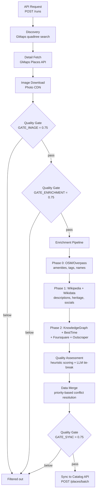

# SoulStep Scraper API

A FastAPI service that discovers sacred places via Google Maps, enriches them from multiple online sources, assesses data quality, and syncs the best information to the main server.

## Features

- **Google Maps Discovery**: Quadtree-based recursive search with cross-run deduplication
- **Multi-Source Enrichment**: Collectors for OSM, Wikipedia, Wikidata, Knowledge Graph, BestTime, Foursquare, Outscraper
- **Quality Assessment**: Heuristic scoring of descriptions with optional LLM tie-breaking
- **Data Merging**: Priority-based conflict resolution across all sources
- **Sync**: Push enriched data with attributes to the main SoulStep server

## Setup

1.  **Install Dependencies**:
    ```bash
    cd soulstep-scraper-api
    python3 -m venv .venv
    source .venv/bin/activate
    pip install -r requirements.txt          # production dependencies
    pip install -r requirements-dev.txt      # adds pytest, ruff (dev/test only)
    ```

2.  **Environment Variables**:
    Create a `.env` file in `soulstep-scraper-api/` (copy from `.env.example`):
    ```env
    # Required
    GOOGLE_MAPS_API_KEY=your_api_key_here
    MAIN_SERVER_URL=http://localhost:3000
    SCRAPER_TIMEZONE=Asia/Dubai

    # Optional collectors (leave blank to disable)
    BESTTIME_API_KEY=
    FOURSQUARE_API_KEY=
    OUTSCRAPER_API_KEY=
    KNOWLEDGE_GRAPH_API_KEY=

    # LLM-based description assessment (leave blank for heuristic-only)
    GEMINI_API_KEY=

    # Database (default: SQLite at ./scraper.db, set for PostgreSQL)
    SCRAPER_DB_URL=
    SCRAPER_DB_PATH=./scraper.db

    # Concurrency tuning (optional, defaults shown)
    SCRAPER_DISCOVERY_CONCURRENCY=10
    SCRAPER_DETAIL_CONCURRENCY=20
    SCRAPER_ENRICHMENT_CONCURRENCY=10
    SCRAPER_MAX_PHOTOS=3
    SCRAPER_IMAGE_CONCURRENCY=40

    # Logging
    LOG_FORMAT=text    # "text" for local dev (also writes logs/external_queries.log); "json" for Cloud Run
    LOG_LEVEL=INFO
    ```

    | Variable | Required | Default | Description |
    |---|---|---|---|
    | `GOOGLE_MAPS_API_KEY` | **Yes** | — | Google Maps/Places API key for discovery and detail fetch |
    | `MAIN_SERVER_URL` | **Yes** | `http://127.0.0.1:3000` | Base URL of the SoulStep Catalog API |
    | `SCRAPER_TIMEZONE` | No | `UTC` | Timezone for normalising opening hours |
    | `GEMINI_API_KEY` | No | — | Enables LLM tie-breaking in description selection |
    | `BESTTIME_API_KEY` | No | — | Enables BestTime collector (busyness forecasts) |
    | `FOURSQUARE_API_KEY` | No | — | Enables Foursquare collector (tips, popularity) |
    | `OUTSCRAPER_API_KEY` | No | — | Enables Outscraper collector (extended reviews) |
    | `KNOWLEDGE_GRAPH_API_KEY` | No | — | Enables Knowledge Graph collector (entity descriptions) |
    | `SCRAPER_DB_URL` | No | — | Full SQLAlchemy DB URL (overrides `SCRAPER_DB_PATH`) |
    | `SCRAPER_DB_PATH` | No | `./scraper.db` | Path to SQLite database file |
    | `SCRAPER_DISCOVERY_CONCURRENCY` | No | `10` | Max concurrent `searchNearby` calls during quadtree discovery |
    | `SCRAPER_DETAIL_CONCURRENCY` | No | `20` | Max concurrent `getPlace` calls during detail fetch |
    | `SCRAPER_ENRICHMENT_CONCURRENCY` | No | `10` | Max places enriched concurrently |
    | `SCRAPER_MAX_PHOTOS` | No | `3` | Photos stored per place. Photo media requests are billed at $0.007/1000 — lower values reduce cost and Phase 3 time |
    | `SCRAPER_IMAGE_CONCURRENCY` | No | `40` | Max concurrent image downloads in Phase 3 (CDN, no API rate limit) |
    | `SCRAPER_GATE_IMAGE_DOWNLOAD` | No | `0.75` | Quality gate threshold for image download phase (0.0–1.0; lower = more places pass) |
    | `SCRAPER_GATE_ENRICHMENT` | No | `0.75` | Quality gate threshold for enrichment phase |
    | `SCRAPER_GATE_SYNC` | No | `0.75` | Quality gate threshold for sync phase |
    | `SCRAPER_TRIGGER_SEO_AFTER_SYNC` | No | `false` | Set to `true` to auto-trigger bulk SEO generation on the catalog API after sync completes |
    | `SCRAPER_CATALOG_ADMIN_TOKEN` | No | — | JWT Bearer token for catalog API admin endpoints (required when `SCRAPER_TRIGGER_SEO_AFTER_SYNC=true`). Obtain via `POST /api/v1/auth/login` |
    | `LOG_FORMAT` | No | `json` | `json` = structured stdout (Cloud Run); `text` = human-readable + writes `logs/external_queries.log` locally |
    | `LOG_LEVEL` | No | `INFO` | Python log level (`DEBUG`, `INFO`, `WARNING`, `ERROR`) |

3.  **Run Server**:
    ```bash
    uvicorn app.main:app --reload --port 8001
    ```

4.  **Run Tests**:
    ```bash
    source .venv/bin/activate
    python -m pytest tests/ -v
    ```

## Architecture



### Pipeline stages (ASCII fallback)

```
Discovery (gmaps quadtree)
    │
    ▼
Primary Details (gmaps Places API - enhanced field mask)
    │
    ▼
Image Download (Google Photo CDN)
    │
    ▼  ← GATE_IMAGE_DOWNLOAD (0.75) filters permanently closed / zero-data places
Enrichment Pipeline (collectors in dependency order)
    ├── Phase 0: OSM/Overpass     →  amenities, contact, wikipedia/wikidata tags, multilingual names
    ├── Phase 1: Wikipedia        →  descriptions (en/ar/hi), images
    │           Wikidata          →  founding date, heritage status, socials, structured data
    └── Phase 2: Knowledge Graph  →  entity descriptions, schema.org types (FREE, 100k/day)
                BestTime          →  busyness forecasts (optional, paid)
                Foursquare        →  tips, popularity (optional, paid)
                Outscraper        →  extended Google reviews (optional, paid)
    │
    ▼  ← GATE_ENRICHMENT (0.75) applied before Phase 0 starts
Quality Assessment (heuristic + LLM hybrid)
    │
    ▼  ← GATE_SYNC (0.75) applied before sync
Sync to Catalog API
```

### Google Places API Cost Notes

| Phase | Endpoint | SKU | Rate |
|-------|----------|-----|------|
| Discovery | `searchNearby` POST | Places - Nearby Search | $0.040 / 1000 |
| Detail fetch | `getPlace` GET (full mask) | Places - Advanced | $0.040 / 1000 |
| Image download | `{photo}/media` GET | Places - Photo Media | $0.007 / 1000 |

**Detail fetch** uses a single merged `getPlace` call with all fields (ESSENTIAL + EXTENDED combined). The previous two-stage approach (cheap ESSENTIAL first, expensive EXTENDED conditionally) was cheaper only if <57.5% of places qualified for the extended call. At the typical 70%+ qualification rate for established religious sites, the single merged call is both cheaper (~11%) and faster (~41% fewer API calls).

**Image download** is capped at `SCRAPER_MAX_PHOTOS` (default 3) per place. Set lower to reduce cost/time; set up to 10 if you need a fuller photo gallery.

### External Query Logging

Every outbound Google Places API call is logged by `app/services/query_log.py`:

- **Local dev** (`LOG_FORMAT=text`): appended to `logs/external_queries.log` (rotating, 5 MB × 3 backups)
- **Cloud Run** (`LOG_FORMAT=json`): stdout → Cloud Logging

**Cloud Logging filter** to see all external API calls:
```
jsonPayload.event="external_query" AND jsonPayload.service="gmaps"
```
Filter by `jsonPayload.caller` to isolate by source:
- `get_places_in_circle` — discovery `searchNearby` calls
- `_fetch_details` — per-place `getPlace` calls
- `autocomplete` / `place_details` — catalog API search proxy calls

### Directory Structure

```
soulstep-scraper-api/app/
  config.py              # Centralised Settings (all env vars read once)
  constants.py           # Named constants (batch sizes, concurrency defaults, radii)
  scrapers/
    base.py              # RateLimiter, AsyncRateLimiter, AtomicCounter, CircuitBreaker
    gmaps.py             # Discovery (quadtree search, dedup) + detail fetching
  collectors/
    __init__.py
    base.py              # BaseCollector ABC, CollectorResult dataclass
    gmaps.py             # GmapsCollector (detail extraction)
    osm.py               # OsmCollector (Overpass API)
    wikipedia.py         # WikipediaCollector (REST API)
    wikidata.py          # WikidataCollector (SPARQL)
    knowledge_graph.py   # KnowledgeGraphCollector (free 100k/day)
    besttime.py          # BestTimeCollector (optional/paid)
    foursquare.py        # FoursquareCollector (optional/paid)
    outscraper.py        # OutscraperCollector (optional/paid)
    registry.py          # Collector discovery + factory
  pipeline/
    __init__.py
    enrichment.py        # Orchestrator: runs collectors in dependency phases
    quality.py           # Description scoring + LLM tie-breaking (Gemini)
    merger.py            # Combines all collector outputs into final data
    place_quality.py     # Place-level quality scoring (0.0–1.0) + gate thresholds
  seeds/
    geo.py               # Pre-seeded geographic boundaries
    place_types.py       # Default place-type → religion mappings
  services/
    run_activity.py      # get_activity_snapshot() — polled by admin UI
    quality_metrics.py   # compute_quality_metrics() — aggregate quality stats
    query_log.py         # log_query() — records every outbound Google Places API call
  db/
    models.py            # SQLModel ORM models
    session.py           # Engine + SessionDep
    scraper.py           # Orchestration (run, resume, sync)
  api/v1/
    scraper.py           # FastAPI router — all scraper endpoints
```

## Geographic Boundaries

Before creating a data location the requested scope must exist in the `GeoBoundary` table. The table is pre-seeded on first startup with all supported regions.

| `boundary_type` | `country` | `state` | Description |
|-----------------|-----------|---------|-------------|
| `country` | `null` | `null` | Entire country (e.g. UAE, India, USA) |
| `state` | parent country | `null` | State/province (e.g. California, Maharashtra) |
| `city` | parent country | parent state *(optional)* | City (e.g. Dubai, Mumbai) |

**Pre-seeded regions:**
- **Countries**: UAE, India, USA, Pakistan
- **UAE cities** (8): Dubai, Abu Dhabi, Sharjah, Ajman, Ras Al Khaimah, Fujairah, Umm Al Quwain, Al Ain
- **USA states** (8): California, Texas, New York, Florida, Illinois, Pennsylvania, Ohio, Georgia
- **India states** (all 28): Maharashtra, Uttar Pradesh, West Bengal, Tamil Nadu, Rajasthan, Karnataka, Gujarat, Andhra Pradesh, Madhya Pradesh, Bihar, Telangana, Odisha, Kerala, Haryana, Punjab, Assam, Jharkhand, Chhattisgarh, Uttarakhand, Himachal Pradesh, Jammu and Kashmir, Goa, Tripura, Manipur, Meghalaya, Nagaland, Arunachal Pradesh, Mizoram, Sikkim
- **India cities** (50+): Mumbai, Delhi, Bangalore, Hyderabad, Chennai, Kolkata, Pune, Ahmedabad, and more
- **Pakistan provinces** (7): Punjab, Sindh, Khyber Pakhtunkhwa, Balochistan, Gilgit-Baltistan, Azad Kashmir, Islamabad Capital Territory
- **Pakistan cities** (top 50): Karachi, Lahore, Faisalabad, Rawalpindi, Gujranwala, Peshawar, Multan, Hyderabad, Islamabad, Quetta, and 40 more

Each boundary also stores a `radius_km` value (approximate search radius) alongside the lat/lng bounding box.

## Usage

### 1. Create a Data Location
**POST** `/api/v1/scraper/data-locations`

Scope the location to a **city**, **state**, or **country** — exactly one must be provided:

```json
{ "name": "Dubai Mosques",    "source_type": "gmaps", "city": "Dubai",      "max_results": 10 }
{ "name": "California Places","source_type": "gmaps", "state": "California","max_results": 20 }
{ "name": "India All",        "source_type": "gmaps", "country": "India",   "max_results": 50 }
```

### 2. Start a Scraper Run
**POST** `/api/v1/scraper/runs`
```json
{
  "location_code": "loc_..."
}
```
Returns a `run_code`. The scraper runs discovery, detail-fetching, and enrichment in the background.

Run status values:
- `pending` → queued, not started yet
- `running` → actively executing
- `completed` → finished successfully
- `failed` → terminated with an error (see `error_message`)
- `cancelled` → manually cancelled
- `interrupted` → process was killed mid-run (set automatically on startup); resume with `/resume`

Run `stage` values (current pipeline phase while `running` or `interrupted`):
- `"discovery"` → searching for places via Google Maps quadtree
- `"detail_fetch"` → fetching place details from Google Places API
- `"enrichment"` → running multi-source enrichment collectors

### 3. Check Run Status
**GET** `/api/v1/scraper/runs/{run_code}`

### 4. View Data
**GET** `/api/v1/scraper/runs/{run_code}/data?search=Mosque`

### 5. View Raw Collector Data (debugging)
**GET** `/api/v1/scraper/runs/{run_code}/raw-data?collector=osm&place_code=gplc_xxx`

### 6. Re-enrich (without re-discovery)
**POST** `/api/v1/scraper/runs/{run_code}/re-enrich`

### 7. List Collectors
**GET** `/api/v1/scraper/collectors`

### 8. Sync to Main Server
**POST** `/api/v1/scraper/runs/{run_code}/sync`

### 9. Resume an Interrupted or Failed Run
**POST** `/api/v1/scraper/runs/{run_code}/resume`

Resumes a run whose status is `interrupted` or `failed`. The run restarts from the stage stored in the `stage` field:
- `null` / `"discovery"` → full pipeline restart
- `"detail_fetch"` → uses persisted `discovered_resource_names`, skips to detail fetch
- `"enrichment"` → skips to enrichment (already-enriched places are skipped automatically)

Response:
```json
{
  "run_code": "run_abc123",
  "status": "interrupted",
  "resume_from_stage": "enrichment",
  "processed_items": 87,
  "total_items": 120
}
```

### 10. Cancel a Run
**POST** `/api/v1/scraper/runs/{run_code}/cancel`

Accepts runs with status `pending`, `running`, or `interrupted`.

### 10a. Get Place Codes for a Run
**GET** `/api/v1/scraper/runs/{run_code}/place-codes`

Returns a list of `place_code` strings for all scraped places in the run. Used by the catalog proxy to delete catalog places when a run is deleted.

### 10b. Delete a Run
**DELETE** `/api/v1/scraper/runs/{run_code}`

Deletes the run and cascades to all `ScrapedPlace`, `RawCollectorData`, and `DiscoveryCell` records for the run.

### 11. Quality Metrics
**GET** `/api/v1/scraper/quality-metrics?run_code=<optional>`

### 12. Quality Score Breakdown (per place)
**GET** `/api/v1/scraper/runs/{run_code}/places/{place_code}/quality-breakdown`

### 13. Map — Discovery Cells
**GET** `/api/v1/scraper/map/cells?run_code=<optional>`

Returns all **leaf (non-saturated)** discovery cells with no rectangle overlap. Optionally filtered by `run_code`.

Response: array of `{ lat_min, lat_max, lng_min, lng_max, depth, result_count, run_code }`.

### 14. Map — Scraped Places
**GET** `/api/v1/scraper/map/places?run_code=<optional>`

Returns all scraped places that have a valid lat/lng in `raw_data` (zero-coord places excluded). Optionally filtered by `run_code`.

Response: array of `{ place_code, name, lat, lng, enrichment_status, quality_gate, quality_score, run_code }`.

Returns a factor-by-factor breakdown of the quality score recomputed from `raw_data` (no new DB columns required).

Response:
```json
{
  "total_score": 0.873,
  "gate": null,
  "factors": [
    { "name": "Rating & Reviews", "weight": 0.30, "raw_score": 0.94, "weighted": 0.282, "detail": "rating=4.8, reviews=5000, bayesian=0.94" },
    ...
  ]
}
```

The `gate` field is `null` when the score passes all gates, or one of `"below_image_gate"`, `"below_enrichment_gate"`, `"below_sync_gate"`.
Returns **404** if the run or place does not exist.

Aggregate quality scoring statistics. When `run_code` is omitted, metrics cover all runs.

Response includes:
- `score_distribution` — 10 buckets (0.0–0.1 … 0.9–1.0) with place counts
- `gate_breakdown` — counts per gate label (`below_image_gate`, `below_enrichment_gate`, `below_sync_gate`, `passed`)
- `near_threshold_counts` — places within ±0.05 of each gate threshold (sensitivity analysis)
- `avg_quality_score`, `median_quality_score`
- `description_source_breakdown`, `enrichment_status_breakdown`
- `per_run_summary` — per-run totals with avg score
- `overall_stats` — `total_scraped`, `total_synced`, `overall_filter_rate_pct`

## Collectors

| Collector | Source | Cost | Extracts |
|-----------|--------|------|----------|
| **gmaps** | Google Places API (New) | ~$0.008/place | Details, photos, reviews, opening hours, accessibility, parking, payment |
| **osm** | Overpass API | Free | Amenities, contact, wikipedia/wikidata tags, multilingual names |
| **wikipedia** | Wikipedia REST API | Free | Descriptions (en/ar/hi), images |
| **wikidata** | Wikidata API | Free | Founding date, heritage status, social media, multilingual labels |
| **knowledge_graph** | Google KG Search | Free (100k/day) | Entity descriptions, schema.org types, images |
| **besttime** | BestTime API | Paid | Busyness forecasts, peak hours |
| **foursquare** | Foursquare API | Paid | User tips, popularity |
| **outscraper** | Outscraper API | Paid | Extended Google reviews (beyond the 5 limit) |

## Quality Assessment

Descriptions from all sources are scored using heuristics (0.0-1.0):
- **Source reliability** (40%): Wikipedia > editorial > knowledge graph > wikidata > generative
- **Length/detail** (30%): Longer descriptions score higher
- **Specificity** (30%): Place name mentions + relevant keywords

When the top 2 candidates are within 0.15, Gemini (`gemini-2.5-flash`) can optionally break the tie or synthesize a combined description. Requires `GEMINI_API_KEY`. This is only triggered for ~10-20% of places.

## Scripts

### Reset Scraper Data (`scripts/reset_scraper_data.py`)

Delete all scraper data (ScrapedPlace, RawCollectorData, DiscoveryCell, ScraperRun, GlobalDiscoveryCell, GlobalGmapsCache) from the scraper DB. DataLocation records are preserved. Use this for a fresh start.

```bash
cd soulstep-scraper-api && source .venv/bin/activate
python scripts/reset_scraper_data.py
```

## Scraper Backend Toggle (`SCRAPER_BACKEND`)

The scraper supports two discovery and detail-fetch backends, selected by the `SCRAPER_BACKEND` env var.

| Value | Behavior | API key required | Cost | Speed |
|---|---|---|---|---|
| `api` *(default)* | Google Places API (New) — HTTP calls | Yes (`GOOGLE_MAPS_API_KEY`) | ~$0.008/place | ~3h/10K places |
| `browser` | Playwright drives Google Maps in Chromium — no API calls | No | $0 | ~24–48h/10K places |

### Browser-specific env vars

| Variable | Default | Description |
|---|---|---|
| `SCRAPER_BACKEND` | `api` | Set to `browser` to enable the Playwright/Chromium path |
| `MAPS_BROWSER_POOL_SIZE` | `2` | Number of concurrent Chromium contexts in `MapsBrowserPool` |
| `MAPS_BROWSER_MAX_PAGES` | `30` | Navigations per browser session before recycling (reduces fingerprinting risk) |
| `MAPS_BROWSER_HEADLESS` | `true` | Run Chromium headless; set `false` for local visual debugging |

### How to enable browser mode

Add to your `.env` file:

```env
SCRAPER_BACKEND=browser
# GOOGLE_MAPS_API_KEY is not required in browser mode
MAPS_BROWSER_POOL_SIZE=2
MAPS_BROWSER_MAX_PAGES=30
MAPS_BROWSER_HEADLESS=true
```

### New files (browser mode)

| File | Purpose |
|---|---|
| `app/services/browser_stealth.py` | Stealth JS patches + UA/viewport/timezone randomisation |
| `app/services/browser_pool.py` | `MapsBrowserPool` with circuit breaker, CAPTCHA detection, session recycling |
| `app/scrapers/gmaps_browser.py` | Browser-based quadtree discovery + `run_gmaps_scraper_browser()` |
| `app/collectors/gmaps_browser.py` | `BrowserGmapsCollector` — drop-in for `GmapsCollector`, same `CollectorResult` shape |
| `tests/test_browser_gmaps.py` | 43 unit tests |

### Integration notes

- **All downstream phases unchanged** — enrichment, quality assessment, merging, and sync all receive the same `CollectorResult` shape regardless of which backend ran discovery.
- **`timezonefinder`** computes `utc_offset_minutes` from lat/lng in browser mode (replaces the Google Places API `utc_offset` field).
- **Circuit breaker** — 3 consecutive CAPTCHA/block detections pause all requests for 10 minutes before retrying.
- **Cloud Run sizing (browser mode)** — use `--memory 2Gi --cpu 2 --timeout 3600`.

---

## Job Dispatcher

Controls how scraper runs are executed after `POST /runs` (and `POST /runs/{code}/resume`). Selected by `SCRAPER_DISPATCH`.

| `SCRAPER_DISPATCH` | Behaviour |
|---|---|
| `local` (default) | Runs scraper in-process via FastAPI `BackgroundTasks`. No GCP needed. Works for local dev and simple Cloud Run Service deployments. Chromium stays co-located — needs 2 GB RAM on the API service. |
| `cloud_run` | Dispatches a Cloud Run Job execution via `google.cloud.run_v2.JobsClient`. API service stays lightweight (512 MB — no Chromium in the API process). |

### Local development

No extra config needed — `SCRAPER_DISPATCH=local` is the default.

### Production (Cloud Run Job)

```env
SCRAPER_DISPATCH=cloud_run
CLOUD_RUN_JOB_NAME=soulstep-scraper-job
CLOUD_RUN_REGION=us-central1
GOOGLE_CLOUD_PROJECT=your-project
```

The job reads `SCRAPER_RUN_CODE` and `SCRAPER_RUN_ACTION` from env vars set by the dispatcher and runs `python -m app.jobs.run` (no HTTP server). Deploy the job with `gcloud run jobs create` — see PRODUCTION.md §5.9h for the full command.

### New files

| File | Purpose |
|---|---|
| `app/jobs/__init__.py` | Package marker |
| `app/jobs/dispatcher.py` | `dispatch_run()` / `dispatch_resume()` — switches between `local` and `cloud_run` backends at runtime |
| `app/jobs/run.py` | Cloud Run Job entrypoint — reads `SCRAPER_RUN_CODE` + `SCRAPER_RUN_ACTION`, calls `run_scraper_task` / `resume_scraper_task` without an HTTP server |

---

## Docker images

Two separate images are built from this directory:

| Image | Dockerfile | Size | Purpose |
|---|---|---|---|
| `soulstep-scraper-api` | `Dockerfile` | ~200 MB | Cloud Run Service — HTTP API only, no Playwright |
| `soulstep-scraper-job` | `Dockerfile.job` | ~900 MB | Cloud Run Job — browser scraper, includes Playwright + Chromium |

Build commands:

```bash
# API Service image
docker build --platform linux/amd64 -f Dockerfile -t soulstep-scraper-api .

# Job image (only needed when SCRAPER_DISPATCH=cloud_run)
docker build --platform linux/amd64 -f Dockerfile.job -t soulstep-scraper-job .
```

`requirements-job.txt` contains job-only Python deps (playwright, timezonefinder, google-cloud-run). These are never installed in the API Service image.

---

## Troubleshooting

### Port 8001 Already in Use
```bash
lsof -ti :8001 | xargs kill -9
```
